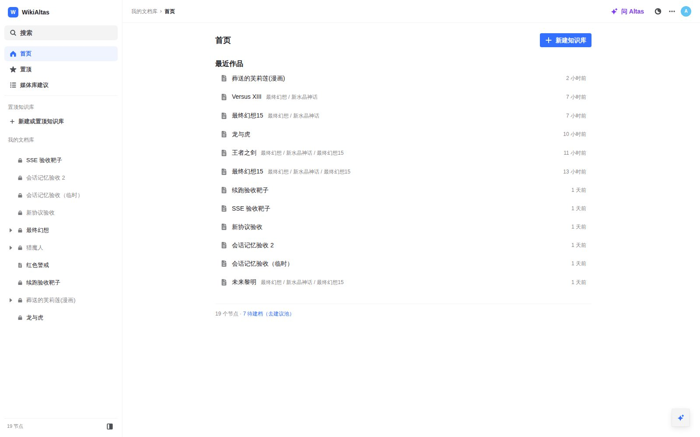
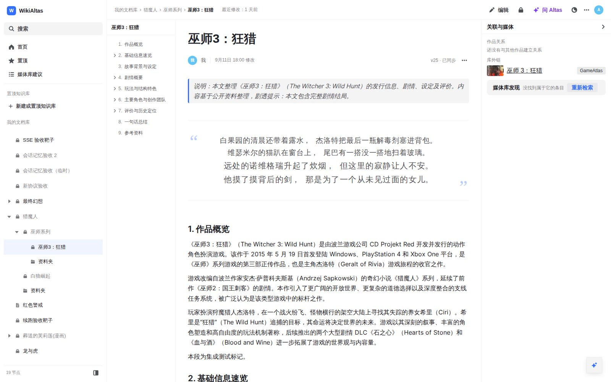
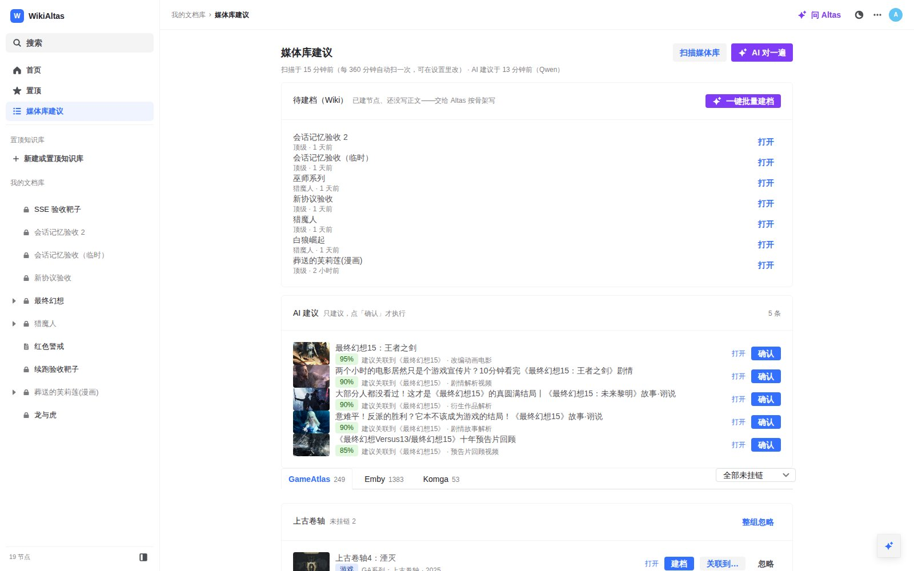
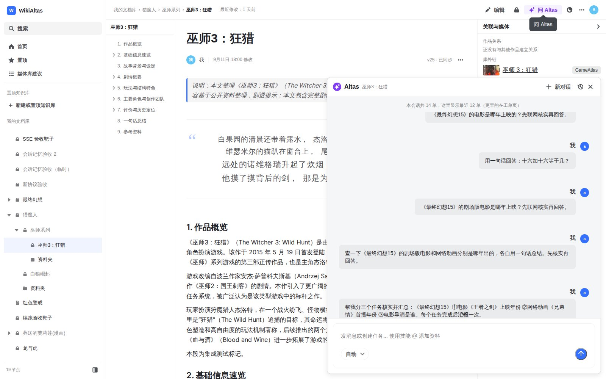

# WikiAltas

> 本项目由不知名网友 **Hao** 与 **DeepSeek V4.1-Flash MAX** 共同完成。

WikiAltas 是一个面向个人媒体库的中文百科创作工具。它把散落在 Emby（影视）、Komga（漫画 / 轻小说）、GameAtlas（游戏）里的收藏，整理成一棵「宇宙 → 系列 → 单作」的知识树，并交给一个名叫 **Altas** 的 LLM 馆员按统一的写作规范产出条目——写完之后，再由宿主把作品和媒体库里的条目自动对上号。

它同时是 [GameAtlas](https://github.com/include-H/GameAtlas) 的孪生项目：游戏条目从 GameAtlas 拉取建议、写好的 Wiki 反哺回去。

## 功能总览

| 能力 | 说明 |
| --- | --- |
| 作品树 | 宇宙 → 系列 → 单作 + 资料夹；每个节点自带大纲、题记、版本历史 |
| LLM 写作 | 馆员 Altas 按 `skills/wiki-writing` 写作（9 章骨架、事实边界、待核实、参考 ≥5）；会话式工单、流式时间线、写完即落库可回滚 |
| 题记 | `:::epigraph` 围栏 → 书页留白渲染（外文原文小字 / 中译大字逐行交替，署名右对齐） |
| 媒体库三源 | GameAtlas / Emby / Komga 统一接入：后台低频扫描清单 → 建议池仪表盘（建档 / 关联 / 忽略） |
| 写完之后自动关联 | 条目写完落库后，宿主自动扫三源召回它的「卫星」：正片、改编影视、解析 / 攻略视频、漫画小说版，出带可信度的建议 |
| AI 只建议不执行 | LLM 永不主动建库 / 挂链：所有建议（可信度 + 一句理由）都等人点「确认」 |
| 反哺 | Wiki 反哺回 GameAtlas（正文 + 简介）；Komga 反哺简介；Emby 仅关联 |
| 访问与隐私 | 只有访问密码没有账号体系；节点级 public / private，访客绝对看不到非公开内容 |

## 设计基调

### 馆员有全权，但没有手

整个系统只有一个 LLM——馆员 Altas，全库接管：你说一句话，它自己判断读什么 skill、查什么资料、改哪些条目、建哪些节点。但它**不能自己动库**：所有涉及结构的动作（把库条目关联到哪、给谁建档）只产出建议，由人逐条确认。确定性的事（扫描媒体库、繁体/简体题名对齐、卷号形态判断）不进模型职责，交给宿主代码做。

### Skill 是内容的唯一权威

写作规范不在代码里复述：9 章骨架、题记写法、事实与剧透策略、各介质的边界，全部住在 `skills/wiki-writing/`，随镜像发布。改写作风格 = 改 markdown 文件，不动一行 Go。

### 视觉是冻结的宪法

界面以飞书为母本（`VISUAL_SPEC.md` 冻结）：颜色全走 Semi Design token，任何地方不新写 hex；紫色是 AI 的唯一强调色，只许出现在 AI 元素上。

## 前端功能

### 首页

最近作品列表与置顶入口；脚注实时统计节点数与待建档数（一键跳建议池）。

### 作品页

- 左栏作品树（可建 / 可移，stub / draft / ready 状态徽标），中栏大纲跟随正文滚动；
- 正文默认编辑态，题记按书页留白渲染；
- **右侧「关联与媒体」栏**：作品关系（→ 续作 / 改编 / 衍生，点标题直达对方节点）、库外链（带封面小图）、以及该作品的「媒体库发现」建议——正文列始终干净，建议不打断阅读；
- 版本历史与回滚、公开 / 私有切换都在页内完成。

### 问 Altas（AI 悬浮窗）

右下角悬浮窗：会话式交互，叙事流 + 工具芯片 + 思考折叠行；写《X》的 Wiki 一句话开工，正文在编辑区实时长出来。位置尺寸记在本地。

### 媒体库建议（建议池）

- 后台按可配置的间隔低频扫描三个媒体库（零 LLM、确定性），落成清单快照；
- 池子按来源分栏（GameAtlas / Emby / Komga 页签）、按「库 / 系列」分组：逐条可建档、关联到已有节点、忽略（单条或整组，可恢复）；
- 「AI 对一遍」出全局匹配建议；每个条目的扫库建议也会直接出现在它自己的作品页上。

### 工单页 / 搜索 / 设置页

- 工单页：每场对话（工单）完整事件流，可续跑、可删除；
- 全文搜索（标题 + 正文）；
- 设置页：模型与 Key、出站代理、媒体库三源地址与 Key、Emby 库角色（正片 / 混杂）、扫描间隔、访问密码。

## 界面预览

| 首页 | 作品页（题记 · 右侧关联与媒体） |
| --- | --- |
|  |  |

| 媒体库建议（三源页签 · AI 建议） | 问 Altas（悬浮窗 · 会话流） |
| --- | --- |
|  |  |

## 媒体库三源接入

| 源 | 认证 | 载体对位 | 反哺 |
| --- | --- | --- | --- |
| GameAtlas | 管理员密码换会话 | 游戏 | Wiki 正文 + 简介写回条目 |
| Emby | API Key + 库角色（正片 / 混杂内容标注） | 影视（电影 / 剧集 / 混在混杂库里的解析、攻略视频） | 仅关联 |
| Komga | API Key | 漫画 / 轻小说（卷判型、抽屉系列拆单册） | 简介写回 series / book |

配置都在设置页；Emby 需要先给每个媒体库标角色，扫描才会收录。

## 技术栈

- 后端：Go（标准库 `net/http`）+ SQLite（modernc.org/sqlite，纯 Go 无 CGO）
- 前端：React + TypeScript + Vite + Semi Design
- LLM：OpenAI Responses 协议，SSE 流式直出到界面

## 本地开发

需要 Go 1.24+、Node.js 20+。

```bash
bash scripts/start-backend.sh    # 后端 :8080（首次带 seed 示例库）
bash scripts/start-frontend.sh   # 前端 :5173（vite 代理 /api）
# 打开 http://localhost:5173
```

或手动：

```bash
cd backend && go run ./cmd/wikiatlas -db ./data/wikiatlas.db -addr :8080 -seed \
  -skill /root/WikiAltas/skills/wiki-writing
cd frontend && npm install && npm run dev
```

## 部署

### 方式一：Docker（推荐）

镜像把前端产物嵌进后端二进制，**单容器单端口**；数据卷挂 `/app/data`（SQLite 库、媒体库清单、会话与工单都在里面）：

```bash
docker run -d --name wikialtas -p 8080:8080 \
  -v /mnt/Docker/WikiAltas/data:/app/data \
  hao0114/wikialtas:latest
```

或使用仓库内的 `docker-compose.yml`（`DATA_DIR` 可改数据目录）。写作 skill 随镜像发布在 `/app/skills/wiki-writing`，启动参数已指好；要自定义就挂载覆盖。

### 方式二：二进制发布包

从 [Releases](https://github.com/include-H/WikiAltas/releases) 下载 `wikiatlas-<version>-linux-amd64.tar.gz`，解压后：

```bash
./wikiatlas -db ./data/wikiatlas.db -addr :8080 -skill ./skills/wiki-writing
```

### GitHub Release 自动发版

推送 `v*` 格式的 tag 会自动构建并上传 GitHub Release 与 Docker Hub：

```bash
git tag v1.0.0 && git push origin v1.0.0
```

产物：
- GitHub Release：`linux-amd64` 的 `tar.gz`、`zip` 与 `sha256` 校验文件；
- Docker Hub：`hao0114/wikialtas:1.0.0`、`hao0114/wikialtas:1.0` 与 `:latest`。

## 配置

**配置项一律在设置页里改**（存在 SQLite，不读环境变量）。进程级只认两个启动参数与一个环境变量：

```bash
-db   ./data/wikiatlas.db                # SQLite 路径
-addr :8080                              # 监听地址（或 WIKIATLAS_ADDR，默认 127.0.0.1:8080）
-skill /path/to/skills/wiki-writing      # 写作 skill 目录
```

### 访问与隐私

- **访问密码**：新库出厂密码 **1234**（`/login` 输它即可进管理态，设置页「访问与隐私」里改）。改密码会立即让旧会话失效。
- **访客**：不登录**绝对看不到非公开内容**——只能只读浏览公开文档（树 / 详情 / 资料 / 检索），私有节点一律 404 或不出现，其余接口 401。
- **节点可见性**：每个宇宙 / 系列 / 单作 / 资料夹都有 `public | private`，**默认 private**；访客可见 = 自身与所有祖先都是 public。

> 出厂密码 `1234` 仅面向家庭 / 内网可信部署保留。暴露到公网前必须先改掉，并在部署侧加反向代理 / 白名单。

## 更多文档

- 设计冻结：[DESIGN_V2.md](DESIGN_V2.md)
- 视觉宪法：[VISUAL_SPEC.md](VISUAL_SPEC.md)
- 工程约束与交接须知：[AGENTS.md](AGENTS.md)
